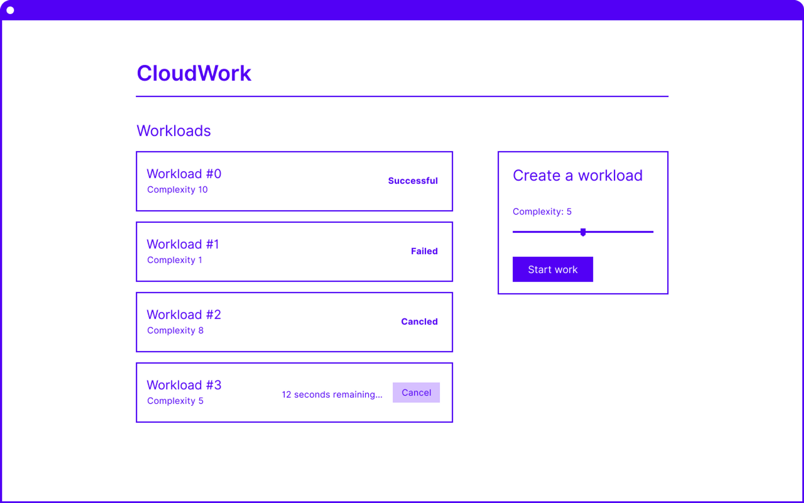

# Cable CloudWork Exercise

## The goals of this exercise

The goal of this exercise is to establish the ability to understand a brief and demonstrate skill in writing client-side state management code. We would like participants to respond to this brief by writing us a sample of code. You are not expected to complete all aspects of the brief.

This exercise will also provide content for the subsequent technical interview.

We ask that you give this exercise an amount of time that makes sense for your schedule. Ideally this would be a couple of hours with a goal of solving at least one of the basic and one of the advanced problems.

The code patterns and frameworks used in this repo offer a good representation of our existing codebase and the problems we most want help solving. However, please feel free to change anything about the existing code - this exercise should not be a test on a library you have no experience with.

Please make use of the existing unstyled UI components. Spend no time worrying about the visual design of the app.

## Setting the scene

CloudWork is a fictitious web app that allows user to manage _workloads_. Workloads are jobs which run in the cloud. They are created with a complexity number which increases the amount of time the workload takes to complete. A workload will complete with a success or failure status.



The app should allow users to:

- View their workloads
- Create new workloads
- View a workload’s up-to-date status
- Cancel workloads that are incomplete

## The code we have provided

This repo contains some code. Please feel free to change anything you like about the code already written.

What’s included:

- A bare bones Next.js app
- A `MockCloudworkService` class which behaves like a CloudWork backend service. It offers Typescript interfaces of the data the service returns.
- Some functional but unstyled UI components (don’t worry about making the app look good).
- A functional `WorkloadForm` component.
- An incomplete `AppController` class which is build with Mobx.

Please feel free to continue using Mobx if you have the experience or like the challenge. Otherwise you can replace it with your own patterns and libraries.

## Problems to solve

Don't feel like you must solve all of these problems. Try and solve at least one of the advanced problems.

### Basic

- Creating a new workload by sending a message to the backend service
- Handling network errors
- Displaying a list of workloads
- Showing the success/failure state of a complete workload

### Advanced

- The ability to cancel a workload only before it is complete
- Display an updating count-down of the time remaining until a workload completes

## Getting started with the code

Run the development server:

```bash
npm run dev
# or
yarn dev
# or
pnpm dev
```

Open [http://localhost:3000](http://localhost:3000) with your browser to see the result.
